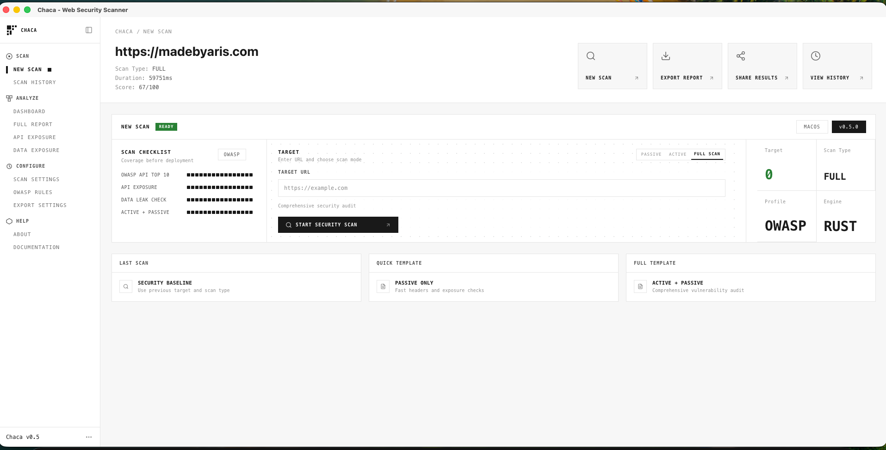
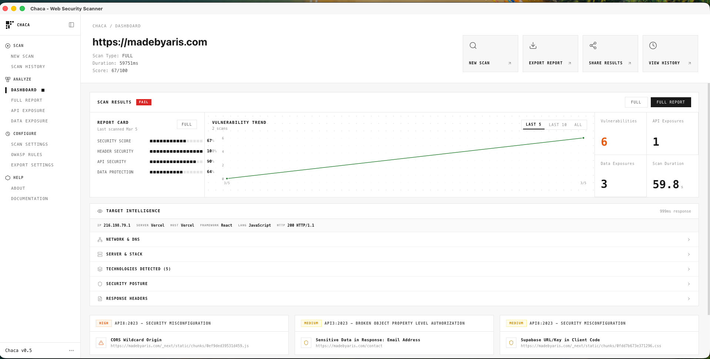
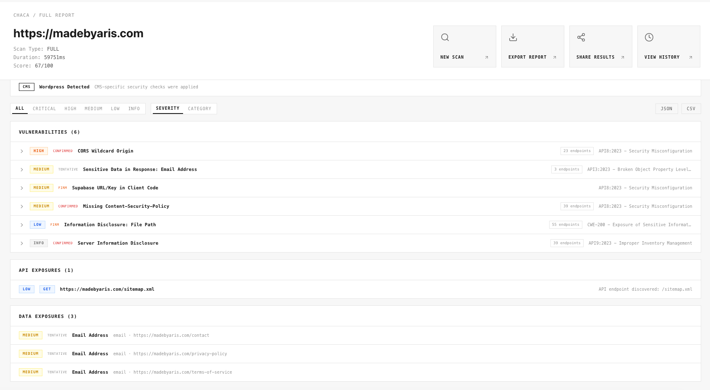

<p align="center">
  <strong>Chaca</strong> — Web Security Scanner
</p>
<p align="center">
  <em>A native desktop security scanner for vibe coders and developers</em>
</p>

<p align="center">
  
  
  
  
</p>

<p align="center">
  Fast, opinionated security audits of your web apps — no terminal required.
</p>

---

## Screenshots

| New Scan | Dashboard | Full Report |
|:--------:|:----------:|:-----------:|
| [](assets/home.png) | [](assets/detail.png) | [](assets/list-vuln.png) |
| Configure target URL, scan mode (Passive/Active/Full), and launch | Security score, vulnerability trend, target intelligence | Filter by severity, CWE references, export to JSON/CSV |

---

## What is Chaca?

**Chaca** = **Cha**lim S**ca**nner — a desktop app built with **Tauri 2**, **React 19**, and **Rust** that scans web applications for security issues. Designed for developers who want actionable results without learning Burp Suite or OWASP ZAP.

---

## Features

### Scanning Engine (Rust)

| Category | Capabilities |
|----------|--------------|
| **Passive** | Security headers, cookies, CORS, CSP, CSRF, clickjacking, JWT, rate limits, deserialization indicators |
| **Active** | XSS (canary + attribute/event injection), SQLi, SSTI, open redirect, path traversal, CORS reflection, CSRF verification |
| **CMS** | WordPress, Drupal, Joomla, Shopify, Magento fingerprinting + platform-specific checks |
| **API** | 57+ sensitive path probes (`/swagger.json`, `/env`, `/graphql`, `/wp-json/wp/v2/users`, …) |
| **Disclosure** | Stack traces, debug headers, file path leaks (Python, Java, PHP, .NET, Go, Ruby, Node.js) |
| **Services** | Supabase, Firebase, PocketBase, admin panels (phpMyAdmin, Adminer, wp-login, debug consoles) |
| **Recon** | IP, DNS, TLS, server fingerprinting, tech detection (frameworks, CDNs, WAFs, hosting), `robots.txt` / `sitemap.xml` / `security.txt` |
| **Knowledge** | 50+ vulnerability definitions with CWE, CVSS severity, remediation, references |
| **Quality** | Confidence scoring (Confirmed/Firm/Tentative), deduplication, category-capped security score (0–100) |

### Desktop App (React + Tailwind)

- Monospace-first minimal UI
- Real-time progress (crawl → passive → active)
- Dashboard with score, charts, stats, target intelligence panel
- Report viewer with CWE links and external references
- Filter by severity and confidence
- Export to JSON and CSV
- Settings page (network, crawling, passive, active, data detection, export) with persistent storage

---

## Tech Stack

| Layer | Technology |
|-------|------------|
| Shell | Tauri 2 |
| Frontend | React 19, TypeScript, Tailwind CSS v4 |
| State | Zustand, tauri-plugin-store |
| UI | Radix UI, Lucide icons, Recharts |
| Backend | Rust (reqwest, regex, tokio, serde, tracing, base64) |

---

## Getting Started

### Prerequisites

- [Node.js](https://nodejs.org/) 18+
- [Rust](https://rustup.rs/) 1.77+
- [Tauri prerequisites](https://v2.tauri.app/start/prerequisites/) for your platform

### Run

```bash
npm install
npm run tauri dev
```

### Build

```bash
npm run tauri build
```

Output: `src-tauri/target/release/bundle/`

### Release (GitHub)

Pre-built binaries for **macOS (Apple Silicon)**, **Windows (x64)**, and **Linux (x64 AppImage)** are published to [GitHub Releases](https://github.com/madebyaris/chaca-scanner/releases) on each version tag.

**To cut a release:**

1. Bump version in `package.json` and `src-tauri/tauri.conf.json`
2. Commit and push
3. Create and push a version tag: `git tag v0.5.0 && git push origin v0.5.0`
4. GitHub Actions builds all platforms and creates a draft release
5. Edit the draft release, add release notes, and publish

**Expected artifacts:**

| Platform | Artifact | Notes |
|----------|----------|-------|
| macOS (Apple Silicon) | `Chaca_0.5.0_aarch64.app.zip` | Unzip and run Chaca.app directly |
| Windows (x64) | `Chaca_0.5.0_x64-portable.exe` | Run directly; requires [WebView2](https://developer.microsoft.com/en-us/microsoft-edge/webview2/) on Windows 10 |
| Windows (x64) | `Chaca_0.5.0_x64-setup.nsis.exe` | Installer (includes WebView2) |
| Linux (x64) | `Chaca_0.5.0_amd64.AppImage` | Run directly |

**Note:** Current releases are unsigned. macOS and Windows may show security warnings; use "Open Anyway" or allow the app in system settings as needed. Ensure **Settings → Actions → General → Workflow permissions** is set to "Read and write permissions" so the release workflow can create releases.

---

## Usage

1. Enter a target URL
2. Choose **Passive** or **Full** scan
3. Review dashboard — score, vulnerabilities, target intelligence
4. Open findings for evidence, remediation, CWE references
5. Export as JSON or CSV

> **Only scan targets you have explicit permission to test.**

---

## Project Structure

```
src/                    # React frontend
├── components/
│   ├── dashboard/      # Scan results, charts, target intelligence
│   ├── layout/         # App shell, sidebar, header
│   ├── settings/       # Settings page and controls
│   └── ui/             # Radix-based primitives
├── store/              # Zustand (scan state, settings)
└── utils/              # Export helpers

src-tauri/              # Rust backend
└── src/
    ├── scanner/
    │   ├── engine.rs   # Scan orchestrator
    │   ├── crawler.rs  # URL discovery
    │   ├── passive.rs  # Passive checks
    │   ├── active.rs   # Active tests
    │   ├── cms.rs      # CMS detection
    │   ├── recon.rs    # Target intelligence
    │   └── rules/      # api_exposure, data_exposure, info_disclosure,
    │                   # exposed_services, vuln_db
    └── lib.rs          # Tauri commands & data structures
```

---

## Author

**Aris Setiawan**

- [madebyaris.com](https://madebyaris.com)
- [GitHub @madebyaris](https://github.com/madebyaris)
- [X @arisberikut](https://x.com/arisberikut)

---

<p align="center">
  <sub>Open-source. Use responsibly.</sub>
</p>
